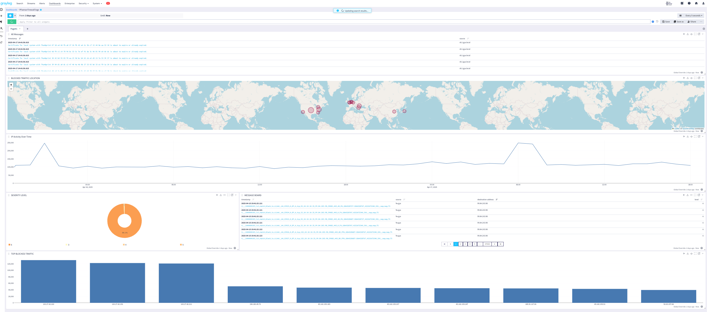
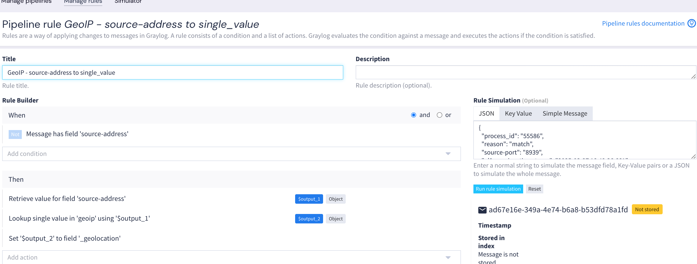
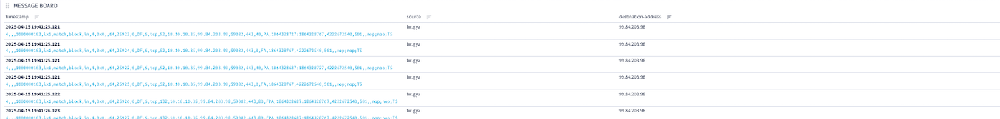

# Log Analysis with Graylog

## Overview
This project highlights my experience using **Graylog** to manage, filter, and visualize logs from various sources in a cybersecurity context. I used Graylog to centralize logs from tools like **OpenVAS**, create visual dashboards, and define pipeline rules for structured analysis.

## Objectives
- Set up a functional Graylog logging server.
- Integrate OpenVAS scan logs into Graylog via syslog.
- Build custom dashboards for visualization.
- Create pipeline rules to extract and tag severity levels.
- Demonstrate detection and monitoring capabilities.

---

## Lab Setup

### Tools Used
- **Graylog** (log management system)
- **OpenVAS** (vulnerability scanner)
- **Ubuntu Server** (host for Graylog)
- **Docker / Docker Compose** (to run containers)

### Architecture
- Logs from OpenVAS forwarded via `syslog` to the Graylog container.
- Dashboards created using Graylog's web interface.
- Custom pipeline rules applied to tag critical vulnerabilities.

---

## Features Implemented

### ✅ Log Ingestion
- Configured OpenVAS to export logs in real time.
- Used a GELF (Graylog Extended Log Format) input to receive structured logs.

### ✅ Dashboards
- Created panels for:
  - Vulnerability severity distribution (pie chart)
  - Log volume over time (line graph)
  - GeoIP map for source IPs
  - Message board showing all incoming traffic logs in real time
- Example: Top 10 most frequent vulnerabilities

### ✅ Pipeline Rules
- Wrote custom rules to:
  - Parse message content
  - Tag logs with `HIGH`, `MEDIUM`, or `LOW` severity
  - Drop irrelevant logs or forward alerts

---

## Screenshots

| Graylog Dashboard | Severity Pipeline Rule | Vulnerability Logs |
|-------------------|------------------------|---------------------|
|  |  |  |

---

## Results
- Achieved centralized, real-time log visibility for OpenVAS.
- Built a visual monitoring dashboard with actionable data.
- Enhanced log clarity and reduced noise using pipeline rules.

---

## Notes
- Project was conducted in a local lab using Docker and simulated scan traffic.
- Screenshots provide proof of real setup and analysis.

---

## Author
**Dahyanna Robinson** – Cybersecurity Intern  
[GitHub](https://github.com/Dahcyber)
